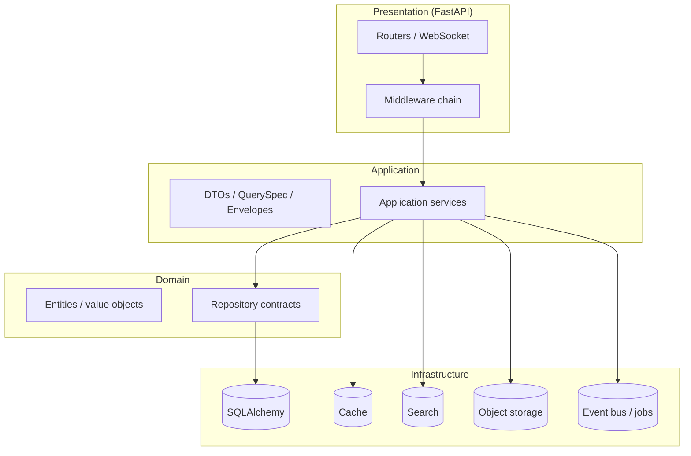
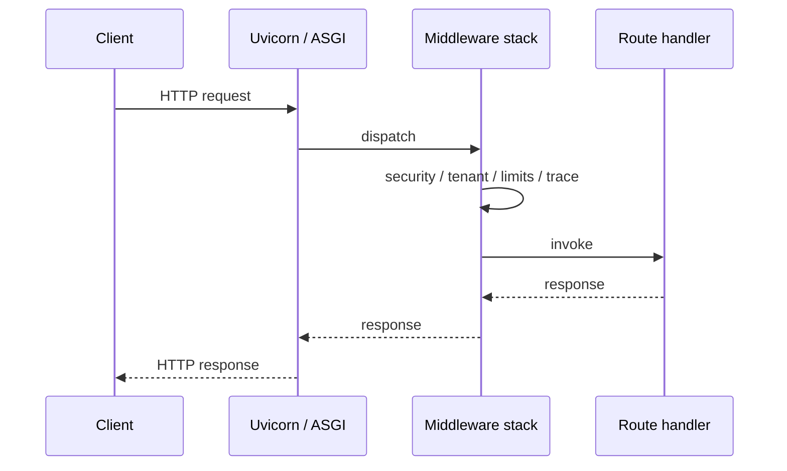
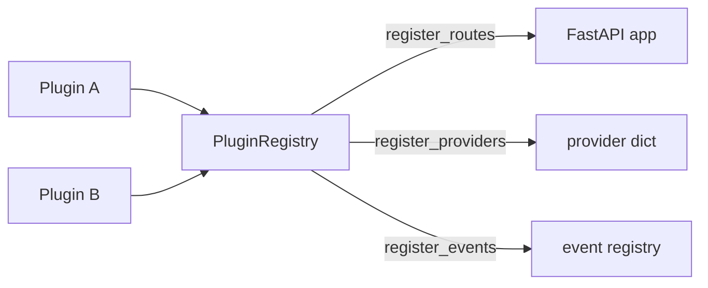
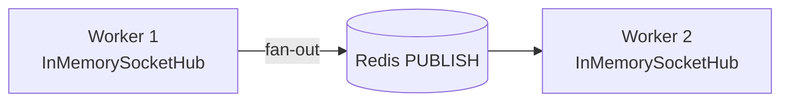
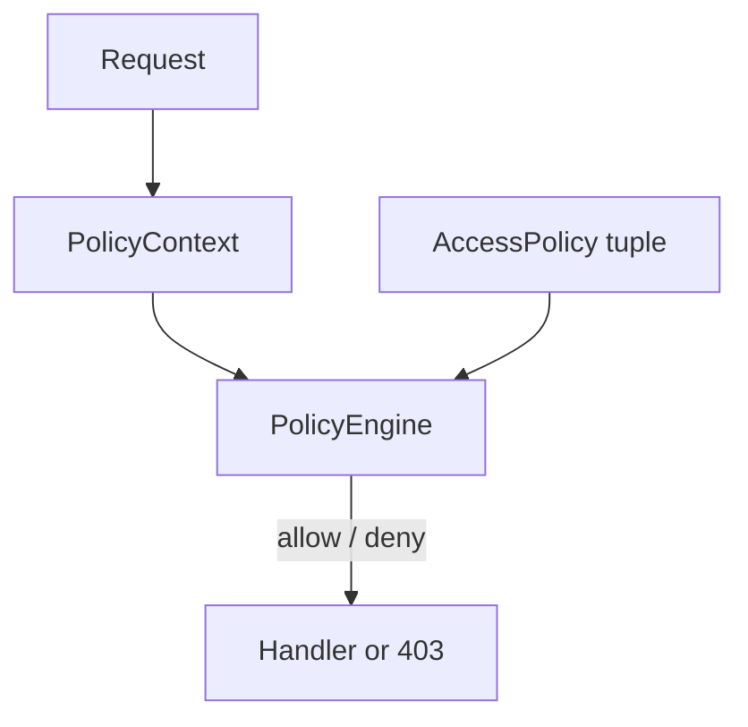

# EitohForge platform architecture (diagrams)

This page complements the narrative blueprint in `secure_backend_sdk_architecture.md` with **diagrams** you can render in GitHub, VS Code (Markdown preview), or any Mermaid-capable viewer.

---

## Layered composition

The SDK follows a **ports-and-adapters** style: domain and application contracts stay free of IO; infrastructure implements adapters; `build_forge_app` and app wiring connect them.

---

## Typical HTTP request path

Cross-cutting behavior runs **before** route handlers: security context, tenant, optional signing, rate limits, observability, and audit (depending on toggles and settings).

---

## Plugin registration

Plugins are optional modules that self-register routes, provider entries, or event subscriptions through a **single registry** applied at app startup.

Implementation reference: `eitohforge_sdk.core.plugins.PluginRegistry` and `eitohforge_sdk.core.plugin_contracts` (typed `RoutePlugin`, `ProviderPlugin`, `EventsPlugin`).

---

## Realtime and Redis fan-out (multi-worker)

When `EITOHFORGE_REALTIME_REDIS_URL` is set, **broadcast** and **direct-to-actor** messages are published to Redis so all workers can deliver. Room membership and presence snapshots remain **process-local** unless you add an external store.

Details: `docs/guides/realtime-websocket.md`.

---

## Policy evaluation (ABAC + DSL)

Authorization can combine **structured policies** (`AccessPolicy`) and **expression** policies (`ExpressionAccessPolicy`) evaluated against `PolicyContext` (principal + request attributes).

Expression DSL reference: `docs/guides/policy.md`.

---

## Where to go next

| Topic | Document |
|--------|----------|
| Plugins (registry, CLI) | `docs/guides/plugins.md` |
| Infrastructure providers | `docs/guides/providers.md` |
| ABAC, Policy DSL, storage policies | `docs/guides/policy.md` |
| Framework checklist | `docs/roadmap/framework-evolution-v0.2-to-v1.md` |
